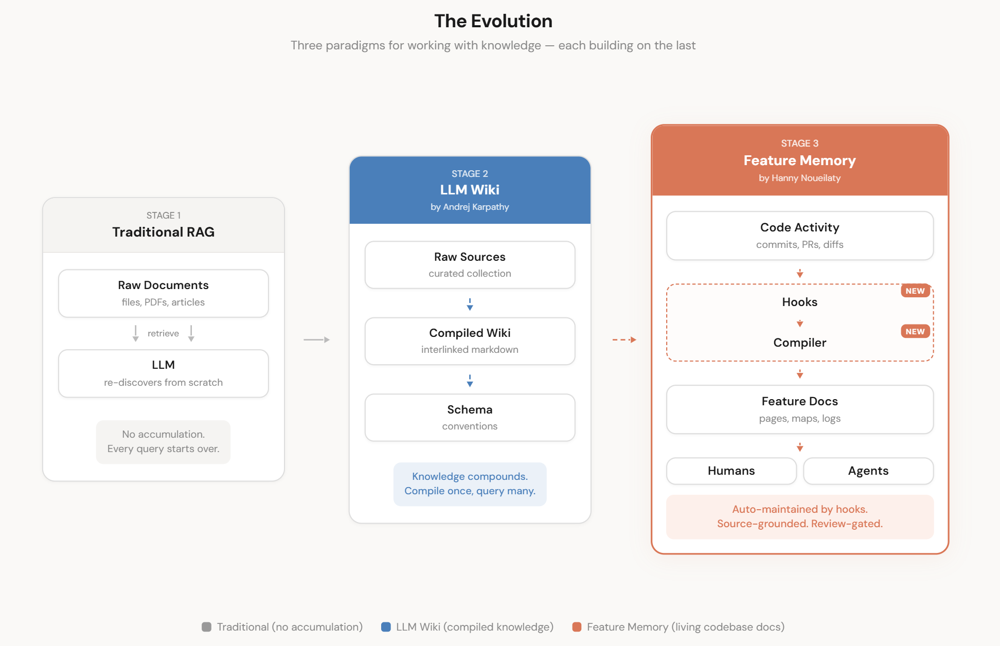
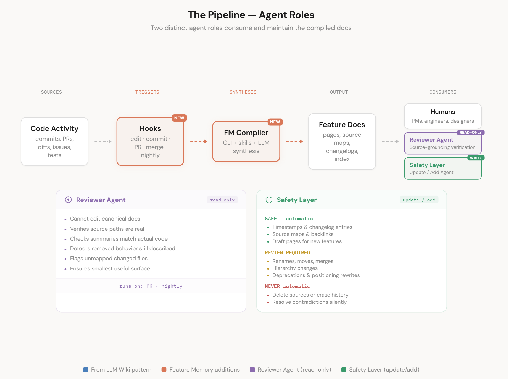
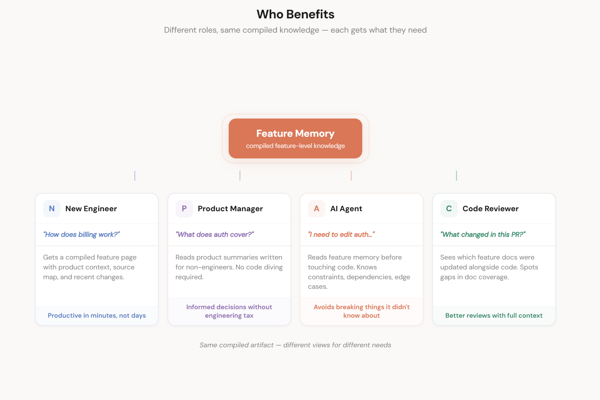

# Feature Memory (LLM-FM)

A documentation compiler for software repos. Maintains feature-level memory so AI coding agents don't rediscover the project from scratch every session.

## The Problem

Every project has two codebases. The real one (files, tests, routes, configs). And the remembered one (what it does, why, which files matter, what's dead). The second one is more useful and decays fastest.

Feature Memory makes it explicit: a structured layer of feature documentation that lives alongside your code, stays current through hooks and skills, and gives agents immediate context when they start a session.



## Install (Claude Code Plugin)

```bash
claude plugin marketplace add h5kk/LLM-FM
claude plugin install feature-memory@h5kk-plugins
```

Then open a Claude Code session in your project and say:

> Initialize feature memory

The agent scaffolds the docs structure, scans your codebase, proposes features, and creates initial feature pages. No scripts to run — the plugin handles everything through skills.

## How It Works

```
docs/feature-memory/
  index.md                    # feature table + auto-generated Mermaid relationship diagram
  recent.md                   # last 5 days of activity
  changelog.md                # append-only global log
  changelog-viewer.html       # interactive changelog browser (open in any browser)
  features/
    auth/                     # large feature — split mode
      index.md                # navigation hub
      product.md              # product audience: what it does for users
      engineering.md          # engineering audience: files, routes, patterns
    billing.md                # small feature — single file
  changelogs/
    changelog.json            # compiled changelog data (loaded by viewer)
  reports/                    # lint reports, reorg proposals

.feature-memory/
  config.yaml                 # globs, route patterns, mode (small | split | mixed)
  events.jsonl                # hook event log (current session)
  events-{session-id}.jsonl   # archived per-session logs
```

Three hooks wire into Claude Code's lifecycle:

| Hook | When | What it does |
|------|------|--------------|
| **SessionStart** | Agent opens a session | Archives previous session events, injects feature list + recent activity |
| **PostToolUse** | After every Edit/Write | Logs the edit, reminds agent which feature docs to update (split-mode aware) |
| **Stop** | Session ends | Captures git author, compiles `changelog.json`, reports features with missing doc updates |

A companion **skill** (`feature-memory`) gives the agent a structured workflow for reading and updating feature pages, changelogs, and the index.

### Dual Developer + Product Changelogs

Every changelog entry is tagged with an audience:

- **Developer** — internal changes: refactors, dependency bumps, test changes
- **Product** — user-facing changes: new behavior, UI changes, API contract changes
- **Both** — when the change matters to both audiences (default)

The **Changelog Viewer** (`docs/feature-memory/changelog-viewer.html`) renders these as a searchable timeline:
- Tabs: **All** | **Product** | **Developer**
- Search by feature, author, summary, file path, or tag
- Tag chips on every entry — up to 5 auto-inferred tags per category (Impact · Quality · Process · Tech)
- Tag filter panel: click to filter; AND across categories, OR within a category
- Toolbar: Expand All, Copy JSON, Copy Markdown, Export CSV
- Git author attribution with consistent color coding
- Timeline grouped by date with expandable entries showing paths and full git details
- Works offline — data is embedded inline, no server required
- Auto-upgrades when a newer plugin version is installed (preserves all existing data)

### Large Feature Support (Split Mode)

Set `mode: split` for a feature to get a sub-folder structure instead of a single file:

```yaml
# .feature-memory/config.yaml
features:
  auth:
    mode: split        # creates features/auth/{index,product,engineering}.md
    globs:
      - "src/auth/**"
```

Sub-pages carry their own `audience` frontmatter so the Stop hook can route doc updates correctly without reading the parent file.

### Relationship Diagram

`docs/feature-memory/index.md` includes an auto-generated Mermaid diagram compiled from `[[feature-id]]` relationship links across all feature pages. The maintainer skill regenerates it when relationships change.



## Quick Start

1. Install the plugin (see above)
2. Open Claude Code in your project
3. Say **"initialize feature memory"** — the init skill walks you through setup
4. Say **"update feature memory"** after making code changes — the maintainer skill keeps docs current

### Agent commands

| Say this | What happens |
|----------|-------------|
| `initialize feature memory` | One-time setup: scaffolds docs, scans codebase, proposes and creates feature pages |
| `update feature memory` | Keeps docs current: updates feature pages, changelogs, source maps after code changes |
| `review feature memory` | Read-only audit: checks docs for stale claims, missing sources, broken relationships |
| `refresh changelog` / `/changelog-refresh` | Re-infers and replaces tags for all existing changelog entries (no git scan) |

### Backfill command

Backfill `changelog.json` from existing git history without waiting for live hooks:

```bash
# Last 48 hours (default)
python plugin/hooks/fm_backfill.py

# Since a specific date
python plugin/hooks/fm_backfill.py --since 2026-01-01

# Since a specific commit (exclusive)
python plugin/hooks/fm_backfill.py --since-commit abc1234

# All commits in the repo
python plugin/hooks/fm_backfill.py --all

# Re-infer and replace tags for all existing entries (no git scan)
python plugin/hooks/fm_backfill.py --retag
```

If your branch follows a Jira naming convention (e.g. `feat/PROJ-123-my-feature`), the ticket identifier is extracted automatically and attached to each changelog entry.

> **Tip for existing installs:** If you installed the plugin before v0.4.0, run `--retag` once to backfill tags on all historical entries, then open `changelog-viewer.html` to use the new tag filter.

### What the plugin includes

| Component | Purpose |
|-----------|---------|
| **Init skill** | One-time setup: scaffolds docs, scans codebase, creates feature pages |
| **Maintainer skill** | Ongoing: updates feature pages, changelogs, source maps after code changes |
| **Reviewer agent** | Read-only audit: checks docs for stale claims, broken links, missing sources |
| **Changelog Refresh skill** | Re-infers and replaces tags for all existing entries (`/changelog-refresh`) |
| **SessionStart hook** | Injects feature list and recent activity; auto-upgrades viewer if template is newer |
| **PostToolUse hook** | Logs edits, reminds which feature docs to update |
| **Stop hook** | Captures git author, compiles `changelog.json` with tags, reports missing doc updates |
| **Backfill script** | Populate changelog from git history; `--retag` to refresh all tags |
| **Changelog Viewer** | Interactive HTML viewer: tabs, tag filter, search, toolbar, offline-capable |

### Phase 1 (planned): `fm` CLI

```bash
pip install feature-memory
fm init
fm scan
fm status
fm report proposal "Refactor auth to OAuth2"
```

## Architecture



Feature Memory is designed in layers:

1. **Markdown docs** (`docs/feature-memory/`) — human-readable, git-tracked feature pages with YAML frontmatter
2. **Config** (`.feature-memory/config.yaml`) — maps source file globs to features
3. **Hooks** — Python scripts that integrate with Claude Code's lifecycle events
4. **Skill** — structured instructions that teach the agent how to maintain FM docs
5. **CLI** (Phase 1) — `fm` command for scanning, status checks, and reports

## Specs

Full implementation specifications live in [`docs/specs/`](docs/specs/README.md):

| # | Spec | Scope |
|---|------|-------|
| 00 | [Project Bootstrap](docs/specs/00-project-bootstrap.md) | Repo structure, Python toolchain, CI |
| 01 | [CLI Foundation](docs/specs/01-cli-foundation.md) | CLI framework, config loading |
| 02 | [Data Model](docs/specs/02-data-model.md) | Markdown templates, schemas, SQLite DDL |
| 03 | [Core Commands](docs/specs/03-core-commands.md) | Every `fm` subcommand |
| 04 | [Hooks and Triggers](docs/specs/04-hooks-and-triggers.md) | Claude Code hooks, git hooks, CI |
| 05 | [Skills](docs/specs/05-skills.md) | SKILL.md for Claude + Codex |
| 06 | [Plugins](docs/specs/06-plugins.md) | Claude/Codex plugin packaging |
| 07 | [Testing](docs/specs/07-testing.md) | Unit tests, fixtures, golden tests |
| 08 | [Publishing](docs/specs/08-publishing.md) | PyPI, GitHub Releases |
| 09 | [Examples and Docs](docs/specs/09-examples-and-docs.md) | Quickstart, user guide |
| 10 | [Roadmap](docs/specs/10-roadmap.md) | Phased milestones |
| 11 | [What's New Generator](docs/specs/11-whats-new.md) | Optional release notes generation |

## Test Results

The Phase 0 design was validated with a real Claude Code integration test against a sample project (Flask + React, 8 features, 30+ source files). Results in [`docs/RepoTest_Iteration1/`](docs/RepoTest_Iteration1/):

- **All hooks fire correctly** with <100ms latency (3s budget)
- **Path matching**: 100% accuracy on a 16-path test battery (8 features)
- **Cross-platform**: Tested on Windows, validated for macOS/Linux compatibility
- **12 findings** documented, 4 fixed in-place, 16 prioritized recommendations

Key numbers:
- PostToolUse: 47ms average per invocation
- Stop hook: 50ms for 1000 events
- SessionStart context: ~2KB for 8 features

## Project Structure

```
plugin/                             # Claude Code plugin
  .claude-plugin/plugin.json        # Plugin manifest
  hooks/                            # Lifecycle hook scripts
  skills/                           # Init and maintainer skills
  agents/                           # Reviewer agent
images/                             # Architectural diagrams and value-prop visuals
docs/
  specs/                            # Implementation specifications (00-11)
  RepoTest_Iteration1/              # Phase 0 test results and findings
  image-catalog.md                  # Image descriptions and alt text
```

## Troubleshooting

**Viewer shows no tags after upgrading to v0.4.0**
Run `python plugin/hooks/fm_backfill.py --retag` once. This re-infers and replaces tags for all existing entries.

**Viewer HTML is outdated (missing tag filter, toolbar)**
The viewer auto-upgrades on the next SessionStart. Alternatively, copy `plugin/assets/changelog-viewer.html` to `docs/feature-memory/changelog-viewer.html` manually — existing JSON data is preserved.

**`--retag` reports "0 entries" (expected: some)**
You're on v0.4.0+ and all entries already have tags. `--retag` now always replaces, so re-running is safe — "0 entries updated" means nothing changed.

**Tag filter not showing all tags from my entries**
Tags are inferred from file paths and commit messages using a closed vocabulary. Check `.feature-memory/config.yaml` to ensure files are mapped to features; unmapped files only get tech-stack tags.

**Changelog viewer is blank**
Check that `docs/feature-memory/changelogs/changelog.json` exists and has entries. Run `python plugin/hooks/fm_backfill.py --all` to populate it from git history.

## License

Not yet specified.
