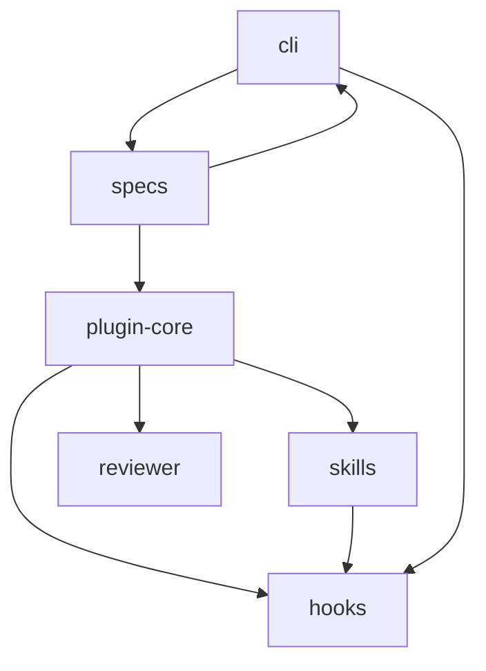

# Feature Memory Index

| Feature | Summary | Status | Review | Updated |
|---------|---------|--------|--------|---------|
| [plugin-core](features/plugin-core.md) | Plugin manifest and packaging structure for the Claude Code plugin | active | needs_review | 2026-05-18 |
| [hooks](features/hooks.md) | Lifecycle hooks for SessionStart, PostToolUse, and Stop events | active | needs_review | 2026-05-18 |
| [skills](features/skills.md) | Init and maintainer SKILL.md files for Claude Code agents | active | needs_review | 2026-05-18 |
| [reviewer](features/reviewer.md) | Read-only reviewer agent that audits FM docs for stale claims | active | needs_review | 2026-05-18 |
| [specs](features/specs.md) | Implementation specifications covering all planned phases | active | needs_review | 2026-05-18 |
| [cli](features/cli.md) | Planned `fm` CLI for deterministic scan, ingest, lint, and review | draft | needs_review | 2026-05-18 |

## Relationship Diagram

