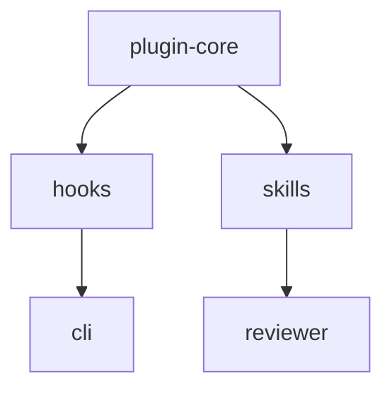

# Feature Memory Enhancement Plan
**Date:** 2026-05-18  
**Author:** h5k  
**Status:** implemented — council review applied

---

## 1. Overview

Three enhancements to the Feature Memory plugin:

1. **Sub-folder hierarchy** — large features can be split into sub-articles under `features/{id}/`
2. **Mermaid relationship diagram** — auto-generated in `index.md` from relationship data
3. **Dual developer + product changelogs** — separate audiences, rich HTML/CSS/JS viewer with timeline, search, expand/collapse, and git author attribution

These align directly with the existing architecture plan (sections 4, 5, and the `mode: small/split/mixed` config already specified). This plan covers what changes in the plugin (skills, hooks, assets), the spec updates, and the README update.

---

## 2. Feature 1: Sub-folder Hierarchy (`mode: split`)

### What changes

When `mode: split` is set in `.feature-memory/config.yaml`, a large feature gets a folder instead of a single file:

```
docs/feature-memory/features/
  auth/
    index.md          ← canonical feature page (replaces auth.md)
    product.md        ← product summary + changelog (product audience)
    engineering.md    ← engineering summary + source map
    changelog.md      ← feature-local changelog (both audiences, structured)
  billing.md          ← small feature stays as single file (mode: small)
```

`mode: mixed` allows both: small features stay as single files, large features use sub-folders. This is already in the architecture plan's config schema (section 7).

### Init skill changes (`plugin/skills/feature-memory-init/SKILL.md`)

- Add a step that asks: "This feature seems large (N source files). Use split mode (sub-folder with product/engineering/changelog pages)?"
- If yes, scaffold `features/{id}/` directory with `index.md`, `product.md`, `engineering.md`, `changelog.md`
- Update `config.yaml` `mode` field accordingly

### Maintainer skill changes (`plugin/skills/feature-memory/SKILL.md`)

- Detect whether a feature uses flat (`features/{id}.md`) or split (`features/{id}/index.md`) layout
- When updating a split feature, route product-facing changes to `product.md` and engineering changes to `engineering.md`
- Keep `index.md` as a navigation hub (one-sentence summary + links to sub-pages)

### Hook changes (`fm_common.py`)

- `match_path_to_features()` already works — no change needed
- Add `get_feature_doc_path(feature_id, docs_root)` helper that checks for `features/{id}/index.md` first, falls back to `features/{id}.md`

### Config schema change

```yaml
mode: mixed   # small | split | mixed (new value)

features:
  auth:
    mode: split   # override per-feature (optional)
    globs:
      - "src/auth/**"
```

---

## 3. Feature 2: Mermaid Relationship Diagram

### What changes

`docs/feature-memory/index.md` gets an auto-generated Mermaid diagram block that reflects the current `Relationships` data across all feature pages.

```markdown
## Relationship Diagram


```

### Maintainer skill changes

Add a "Regenerate diagram" step at the end of every update workflow:
1. Read all feature pages' `## Relationships` sections
2. Extract `[[feature-id]]` links with their relationship type (parent → child, sibling, reuses)
3. Rebuild the Mermaid block in `index.md`

Diagram edge types:
- Parent/child: `parent --> child` (solid arrow)
- Sibling: `A --- B` (line, no arrow)
- Reuses: `A -.-> B` (dashed arrow)

### Init skill changes

Generate an initial diagram after all feature pages are created (Step 5 of the init workflow).

### No hook changes needed

The diagram is purely derived from relationship data already in the docs — no new data collection required.

---

## 4. Feature 3: Dual Changelogs with HTML Viewer

### 4.1 Changelog data model changes

Each changelog entry gets an `audience` field and git author fields:

```yaml
---
type: change_event
schema_version: 2
event_id: 2026-05-18T21-44-12Z-auth-login-validation
created: 2026-05-18T21:44:12Z
feature_id: auth
audience: developer          # developer | product | both
scope: feature
source: git-commit
source_ref: abc1234
git_author: h5k
git_email: resostudios@gmail.com
git_message: "Fix login validation to reject blank emails"
confidence: medium
review_status: needs_review
paths:
  - apps/web/src/auth/LoginForm.tsx
kind:
  - behavior-change
  - validation
---

Login validation now rejects blank emails before calling the API.
```

### 4.2 Compiled changelog JSON

A new compiled file at `docs/feature-memory/changelogs/changelog.json` is generated by the Stop hook and/or maintainer skill. It aggregates all change events across all feature pages:

```json
{
  "schema_version": 2,
  "generated": "2026-05-18T21:44:12Z",
  "entries": [
    {
      "event_id": "2026-05-18T21-44-12Z-auth-login-validation",
      "date": "2026-05-18",
      "feature_id": "auth",
      "feature_title": "Auth",
      "audience": "developer",
      "summary": "Login validation now rejects blank emails before calling the API.",
      "kind": ["behavior-change", "validation"],
      "paths": ["apps/web/src/auth/LoginForm.tsx"],
      "git_author": "h5k",
      "git_message": "Fix login validation to reject blank emails",
      "source_ref": "abc1234",
      "confidence": "medium",
      "review_status": "needs_review"
    }
  ]
}
```

### 4.3 HTML Changelog Viewer

New file: `docs/feature-memory/changelog-viewer.html`

A self-contained HTML/CSS/JS file that:
- Loads `changelogs/changelog.json` via `fetch()` (relative URL)
- Renders a **timeline** sorted by date (newest first)
- Has a **search bar** (filters by feature name, summary text, git author, kind)
- Has **audience tabs**: `All` | `Product` | `Developer`
- Each entry shows: date, feature badge, summary, git author chip
- **Expand/collapse** each entry to reveal: full description, file paths, git message, source ref, confidence, review status
- Responsive layout, works offline if JSON is co-located

#### Viewer structure

```
changelog-viewer.html
  <head> — inline CSS (no external deps)
  <body>
    <header>
      <h1>Feature Memory Changelog</h1>
      <div class="tabs">All | Product | Developer</div>
      <input class="search" placeholder="Search changes...">
    </header>
    <main class="timeline">
      <!-- per date group -->
      <section class="date-group">
        <h2 class="date-label">2026-05-18</h2>
        <!-- per entry -->
        <article class="entry" data-audience="developer" data-feature="auth">
          <div class="entry-header">
            <span class="feature-badge">auth</span>
            <span class="summary">Login validation now rejects blank emails</span>
            <span class="author-chip">h5k</span>
            <button class="expand-btn">▼</button>
          </div>
          <div class="entry-detail" hidden>
            <p class="paths">apps/web/src/auth/LoginForm.tsx</p>
            <p class="git-msg">"Fix login validation to reject blank emails"</p>
            <p class="meta">confidence: medium · ref: abc1234</p>
          </div>
        </article>
      </section>
    </main>
  </body>
  <script> — inline JS, no framework
    // 1. fetch changelog.json
    // 2. render entries grouped by date
    // 3. tabs filter by audience
    // 4. search filters by text match across feature, summary, author, paths
    // 5. expand/collapse toggles entry-detail visibility
  </script>
```

### 4.4 Git author extraction in hooks

`claude_post_tool.py` should call `git log -1 --format="%an|%ae|%s|%H" HEAD 2>/dev/null` when logging an event, and include `git_author`, `git_email`, `git_message`, `git_hash` in the event JSON if available.

`claude_stop.py` should compile `changelogs/changelog.json` from:
1. All change events in `events.jsonl` (session-level)
2. Existing `changelog.json` (append, deduplicate by event_id)

### 4.5 Skill changelog workflow

**Maintainer skill** gets a new step after updating docs:
1. Determine `audience` for this change (product if user-facing behavior changed, developer if internal/refactor, both if both)
2. Write a structured changelog entry with the audience field
3. Mark whether it should appear in the HTML viewer (all entries do by default)

**Init skill** gets a new step: generate initial `changelogs/changelog.json` (empty entries array) and `changelog-viewer.html`.

---

## 5. Files Changed

### Modified

| File | Change |
|------|--------|
| `plugin/skills/feature-memory-init/SKILL.md` | Add split mode prompting, diagram generation, changelog viewer init |
| `plugin/skills/feature-memory/SKILL.md` | Add split mode routing, diagram regeneration, audience-tagged changelog entries |
| `plugin/hooks/fm_common.py` | Add `get_feature_doc_path()`, git author extraction helper |
| `plugin/hooks/claude_post_tool.py` | Enrich events with git author |
| `plugin/hooks/claude_stop.py` | Compile changelogs/changelog.json |
| `plugin/.claude-plugin/plugin.json` | Version bump 0.1.0 → 0.2.0 |
| `README.md` | Document new features with examples |
| `docs/specs/02-data-model.md` | Add audience field, git fields to changelog entry schema |
| `docs/specs/05-skills.md` | Document new skill behaviors |
| `feature-memory-architecture-plan.md` | Update sections 4, 5, 6, 14 |

### New

| File | Purpose |
|------|---------|
| `docs/feature-memory/changelogs/changelog.json` | Compiled changelog data (generated) |
| `plugin/assets/changelog-viewer.html` | Template HTML viewer (copied to project on init) |
| `docs/feature-memory/changelog-viewer.html` | The viewer for LLM-FM itself |

---

## 6. Implementation Order

1. **`fm_common.py`** — add `get_feature_doc_path()` + `get_git_author()` helpers
2. **`claude_post_tool.py`** — use `get_git_author()` when writing events
3. **`claude_stop.py`** — compile changelog.json from events
4. **`changelog-viewer.html`** (template + LLM-FM instance) — HTML/CSS/JS viewer
5. **Init skill** — split mode + diagram generation + viewer init
6. **Maintainer skill** — split mode routing + diagram regen + audience-tagged entries
7. **README** — document all new features
8. **Spec updates** — data-model and skills specs
9. **E2E validation** — run init on a test project, verify diagram, verify viewer

---

## 7. Agent Council Decisions (Applied)

Council ran via multi-model consensus (Claude + Codex). All 5 open questions resolved:

| # | Question | Decision | Rationale |
|---|----------|----------|-----------|
| 1 | `changelog.json` committed or gitignored? | **Committed** | Viewer needs it; diffs are stable when nothing changed; add to `protected_paths` |
| 2 | Single HTML file or split? | **Single file, inline JSON embed** | `fetch()` fails on `file://` in Chrome/Safari — CORS blocker. Embed data in `<script id="changelog-data" type="application/json">` tag; Stop hook does string replacement to update it |
| 3 | One JSON + audience filter or two files? | **One file, audience filter** | Two files create sync problem for `audience: both` entries; viewer tabs handle filtering client-side |
| 4 | Non-git repos: fail gracefully? | **Yes, silently** | `subprocess.run()` wrapped in try/except; fields set to `null`; write to `errors.log` only; never to stdout (would corrupt JSON hook output) |
| 5 | Sub-page frontmatter: own or inherit? | **Own minimal frontmatter** | Sub-pages own `type`, `section`, `parent_feature`, `audience`, `updated`. NOT `feature_id`, `status`, `confidence`. Putting `audience` on sub-page makes path-to-audience O(1) in Stop hook — avoids extra file read inside 3s budget |

### Council-flagged blocking issues (all fixed in implementation)

| Issue | Fix applied |
|-------|-------------|
| `fetch()` CORS on `file://` | Inline JSON embed in `<script id="changelog-data">` tag; Stop hook updates it via regex replace |
| `git log` in PostToolUse violates 3s budget | Moved to Stop hook (15s budget); PostToolUse stays at pure event logging |
| Stop coverage check hardcodes flat path | `get_feature_doc_path()` called inside Stop hook; also checks `features/{id}/` prefix for split-mode sub-pages |
| SessionStart clears events before Stop compiles | Archives to `events-{session_id}.jsonl` before truncating |
| Stop compilation O(n feature files) | Compiles from JSONL events (already in memory), not markdown |

## 8. Open Questions for Agent Council (Original)

1. Should `changelog.json` be committed to git or .gitignored (generated artifact)?
   - **Lean toward:** committed — it's the data source for the viewer and useful in PR diffs
2. Should the HTML viewer be a single self-contained file or split into HTML/CSS/JS?
   - **Lean toward:** single file — easier to distribute as a plugin asset, no build step
3. Should developer vs product changelog be two JSON files or one with an audience filter?
   - **Lean toward:** one file with audience field — simpler to maintain, viewer filters client-side
4. Should `git log` calls in hooks fail gracefully (non-git repos)?
   - **Yes** — wrap in try/except, omit git fields if not available
5. For split mode, should `product.md` and `engineering.md` have their own frontmatter or inherit from `index.md`?
   - **Lean toward:** own frontmatter with `type: feature-section` + `parent: {id}` — enables per-section confidence/review_status

---

## 8. Tests / Validation Checklist

- [ ] Init on a fresh project: creates `changelog-viewer.html` and `changelogs/changelog.json`
- [ ] Init on large feature: offers split mode, creates sub-folder structure
- [ ] Maintainer skill after a code change: writes entry with correct `audience` field
- [ ] Stop hook: compiles `changelog.json` with git author populated
- [ ] Changelog viewer: loads JSON, tabs filter, search works, entries expand/collapse
- [ ] Mermaid diagram in `index.md`: reflects actual relationships after init
- [ ] Diagram updates after maintainer skill adds a new relationship
- [ ] Non-git repo: hooks don't crash when `git log` fails
- [ ] Reviewer agent: flags changelog entries with missing `audience` field (FM016 lint check)
