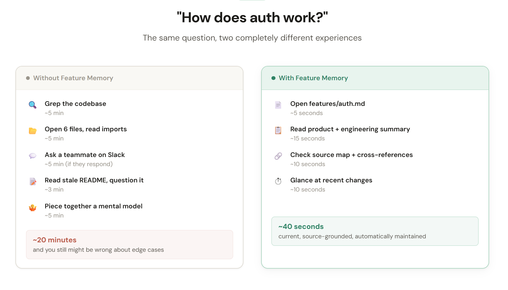
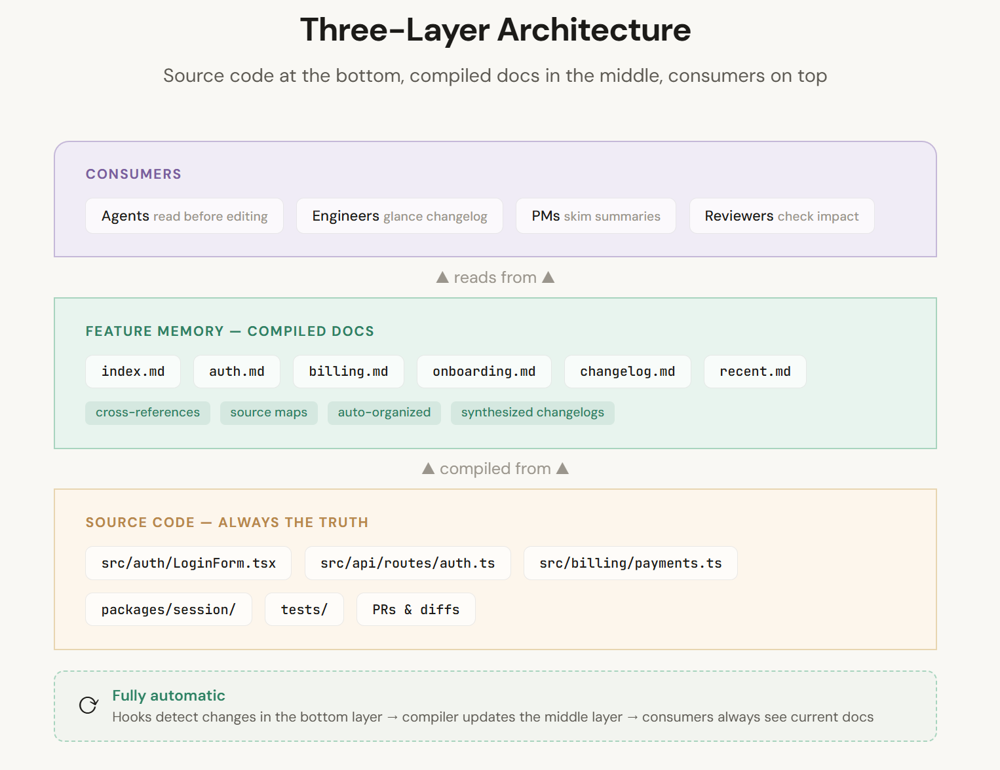
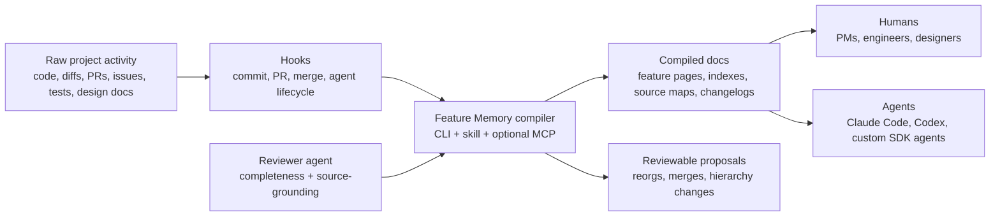
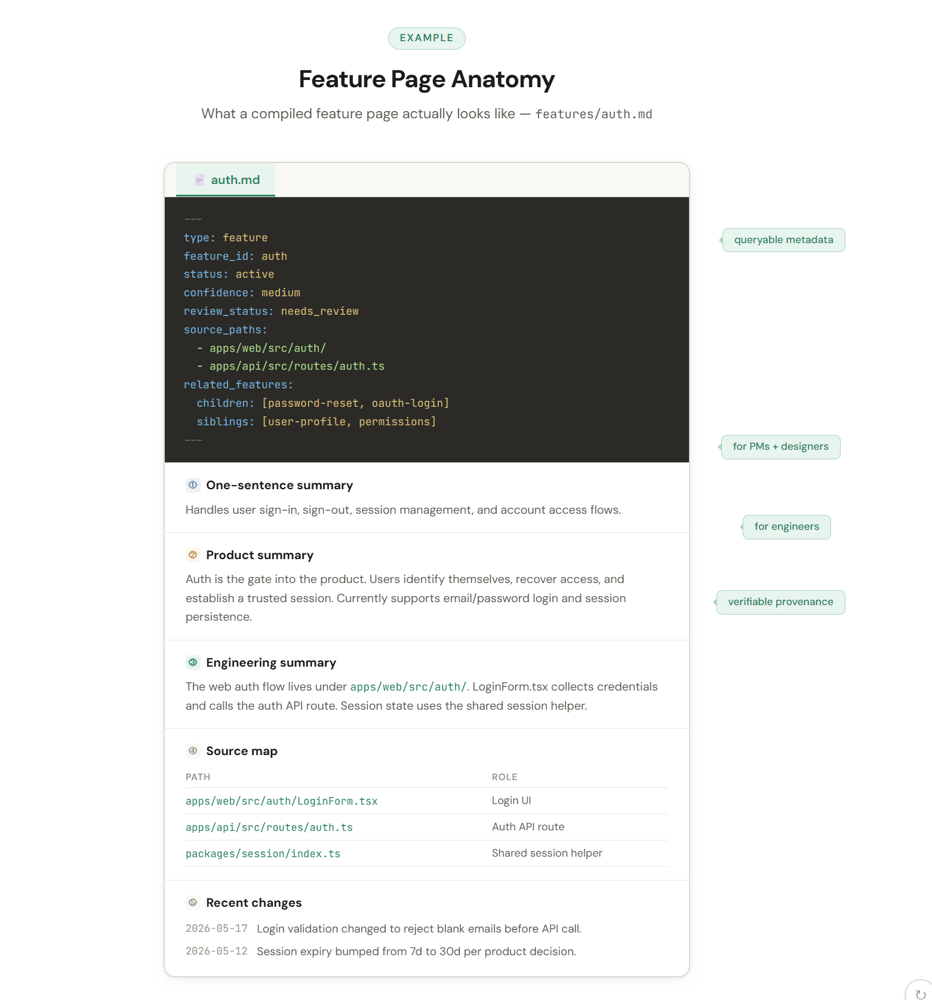
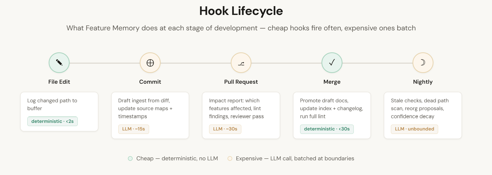
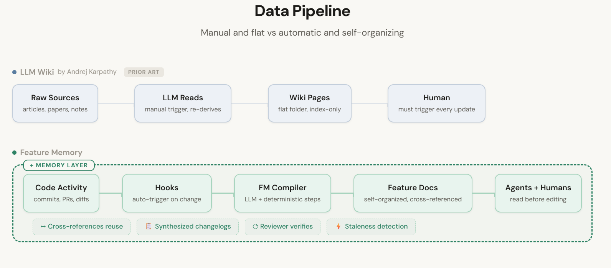

# ذاكرة الميزات (Feature Memory): ويكي LLM لقواعد الشيفرة الحية

مسودة لمُجمِّع توثيق أصيل داخل المستودع.

## الفكرة الجوهرية

كل مشروع برمجي يحتوي على قاعدتي شيفرة.

الأولى هي قاعدة الشيفرة الفعلية — الملفات، الاختبارات، عمليات الترحيل، المسارات، المكونات، الإعدادات، طلبات الدمج، الالتزامات، وآثار الإنتاج.

الثانية هي **قاعدة الشيفرة المتذكَّرة** — ذلك الشيء الذي يحمله البشر والوكلاء في أذهانهم. ماذا يفعل المنتج، ولماذا توجد ميزة معينة، وأي الملفات مهمة، وأي قيد غريب لا يزال ساريًا، وأي سلوك قديم أصبح ميتًا. هذه القاعدة الثانية عادةً ما تكون أكثر فائدة عندما تحاول إجراء تغيير. وهي أيضًا التي **تتآكل بأسرع ما يمكن**.

الاقتراح: اجعل تلك القاعدة الثانية صريحة. سمِّها **ذاكرة الميزات (Feature Memory)**.

```
raw code activity → hooks → FM compiler → compiled feature docs → agents + humans
```

يستعير هذا النهج الحدس الجوهري من نمط LLM Wiki. لا تجعل النموذج يعيد اكتشاف المشروع من الملفات الخام عند كل سؤال. دعه **يجمِّع تراكميًا** المعرفة المهمة في قطعة أثرية مستمرة ومترابطة.

لكن بدلًا من تجميع مقالات أو ملاحظات شخصية في ويكي عام، نجمِّع **النشاط البرمجي في ذاكرة على مستوى الميزات**.

كل ميزة ذات معنى تحصل على صفحة يتم صيانتها تحتوي على:

- **إدخال فهرس من جملة واحدة**
- **ملخص منتج/أعمال** قصير (لمديري المنتجات والمصممين والمهندسين الجدد)
- **ملخص هندسي** قصير (للمطورين — يذكر الملفات والمسارات والمكونات)
- **خريطة مصادر** تربط ملفات الشيفرة بالميزات
- **ملاحظات علاقات** (ميزات أب، أبناء، أشقاء، مكونات مشتركة)
- **سجل تغييرات إلحاقي فقط**
- **بيانات وصفية**: طوابع زمنية، درجات ثقة، حالة المراجعة

الإنسان يملك الذوق والحكم والنية. الوكيل يملك مسك الدفاتر.



## لماذا لا نستخدم رسمًا بيانيًا فحسب؟

أمر مغرٍ. قواعد الشيفرة عبارة عن رسوم بيانية. المنتجات عبارة عن رسوم بيانية. الميزات تعتمد على بعضها. الملفات تستورد بعضها.

لكن الوكلاء لا يريدون بالضرورة الركيزة الأنظف رياضيًا. إنهم يريدون الركيزة التي يمكنهم **قراءتها، وترقيعها، والاستشهاد بها، والتعافي منها**.

ملف markdown يحتوي على ملخص جيد وروابط مصادر وسجل تغييرات غالبًا ما يكون أكثر فائدة لنموذج LLM من استعلام رسم بياني دقيق لكن معتم. الصفحة ليست بديلًا عن البنية — إنها **العرض المجمَّع القابل للقراءة من قبل الوكيل** للبنية.

الحيلة هي وضع بنية كافية حول ملفات markdown:

```
YAML frontmatter  →  metadata you can query
stable slugs      →  identity that survives renames  
wikilinks         →  relationships you can traverse
source maps       →  provenance you can verify
changelogs        →  time you can audit
CLI               →  operations you can automate
hooks             →  refresh that happens without asking
review gates      →  safety for risky edits
```

الرسم البياني موجود ضمنيًا. يمكن تجميعه من المستندات متى احتجت إليه. لكن **المستندات تبقى الواجهة الأساسية** — الشيء الذي يقرأه البشر والوكلاء فعلًا.

## شكل النظام

```
Sources → Compiler → Compiled Docs → Consumers
                ↑                        ↓
           Reviewer ← ← ← ← ← ← ← Proposals
```

أربع طبقات:

```
1. Sources         code, tests, diffs, commits, PRs, design docs
2. Compiled docs   feature pages, indexes, source maps, changelogs
3. Metadata        frontmatter, timestamps, confidence, status, hashes
4. Tools           CLI, hooks, skills, plugins, MCP server, reviewer agent
```

**المصادر الخام هي دائمًا مصدر الحقيقة.** المستندات المجمَّعة هي طبقة الذاكرة المُصانة. المخطط يخبر الوكيل كيف يتصرف بوصفه **مشرفًا منضبطًا** بدلًا من ملخِّص عام.



إليك كيف تتدفق البيانات:



## كيف تبدو صفحة الميزة

```md
---
type: feature
feature_id: auth
status: active
created: 2026-05-17
updated: 2026-05-17
last_code_touch: 2026-05-17
confidence: medium
review_status: needs_review
source_paths:
  - apps/web/src/auth/
  - apps/api/src/routes/auth.ts
related_features:
  parents: []
  children: [password-reset, oauth-login]
  siblings: [user-profile, permissions]
---

# Auth

## One-sentence summary

Handles user sign-in, sign-out, session management, and account access flows.

## Product / business summary

Auth is the gate into the product. Users identify themselves, recover access,
and establish a trusted session. Currently supports email/password login and
session persistence. OAuth and password reset are tracked as child flows.

## Engineering summary

The web auth flow lives under `apps/web/src/auth/`. `LoginForm.tsx` collects
credentials and calls `apps/api/src/routes/auth.ts`. Session state uses the
shared session helper, read by protected route guards. Tests cover successful
login and invalid credentials; expiry behavior is partially covered.

## Source map

| Path | Role |
|---|---|
| `apps/web/src/auth/LoginForm.tsx` | Login UI |
| `apps/api/src/routes/auth.ts` | Auth API route |
| `packages/session/index.ts` | Shared session helper |

## Recent changes

- 2026-05-17 — Login validation changed to reject blank emails before API call.
```

ليست موسوعية. مجرد الصفحة التي يقرأها الوكيل **قبل** لمس المصادقة والتي يتصفحها الإنسان قبل الانضمام إلى محادثة.



## الخطافات هي محرك الصيانة

التوثيق اليدوي يتعفن. اللحظة المناسبة لتحديث التوثيق هي دائمًا اللحظة التي يريد فيها الجميع المضي قدمًا. لذا يعمل النظام **قرب لحظة التغيير**:

```
file edit → log path (free, <2s)
commit    → draft ingest, update source maps (<15s)
PR        → impact report, lint findings (<30s)
merge     → promote docs, update index, run full lint (<30s)
nightly   → stale checks, reorg proposals (unbounded)
```

هذا يتناسب جيدًا مع بيئات الوكلاء الحديثة:

- **Claude Code** لديه خطافات دورة حياة مع خمسة أنواع من المعالجات — أوامر، معالجات HTTP، أدوات MCP، محفزات، ووكلاء فرعيون — حول أحداث مثل `PostToolUse`، `SessionStart`، `Stop`
- **Codex** لديه خطافات دورة حياة لنفس نقاط الأحداث، وإن كانت حاليًا مقتصرة على معالجات الأوامر (معالجات المحفزات والوكلاء يتم تحليلها لكنها لا تُنفَّذ بعد)
- **Skills** تُغلِّف تعليمات سير العمل
- **Plugins** تُغلِّف النظام بأكمله للتثبيت

**نموذج التكلفة مهم.** ليس كل خطاف يجب أن يستدعي LLM:

```
cheap (deterministic, milliseconds):  log paths, update timestamps, append events
expensive (LLM, seconds):             generate summaries, run reviews
```

الخطافات الرخيصة تُطلَق عند كل تعديل. الخطافات المكلفة تُجمَّع عند حدود ذات معنى — التزام، طلب دمج، دمج. تكلفة كل التزام تبقى قريبة من الصفر. تكلفة كل طلب دمج: بضعة سنتات.

**صيانة التوثيق تصبح أثرًا جانبيًا لصيانة البرمجيات**، وليست عملًا روتينيًا منفصلًا.





## واجهة سطر الأوامر (CLI)

```
deterministic work → CLI
synthesis work     → agent (citing sources, writing patches)
```

```bash
fm init                              # scaffold the structure
fm detect --diff HEAD~1..HEAD        # what changed? classify files
fm map --paths src/auth/login.py     # which features are affected?
fm ingest --diff HEAD~1..HEAD        # update docs from changes
fm lint                              # 15 deterministic quality checks
fm review                            # lint + LLM source verification
fm context --for-agent               # compact context for injection
fm query "how does signup work?"     # search feature docs
fm propose-reorg                     # suggest structural changes
fm apply-proposal report.yaml        # execute reviewed proposals
```

**قاعدة عامة:** إذا كان يمكن تنفيذه بشكل حتمي، يذهب إلى CLI. إذا احتاج إلى توليف، النموذج يقوم به — لكنه **يستشهد بمسارات المصادر** ويكتب **ترقيعات قابلة للمراجعة**.

## الكتابات الآمنة مقابل الكتابات المخيفة

**هذا هو أهم تفصيل تصميمي.**

يجب أن يحدِّث الوكيل المستندات تلقائيًا. لكن **لا** يجب أن يعيد تشكيل قاعدة المعرفة كلما شعر بالذكاء.

```
SAFE (automatic):
  timestamps, changelog entries, source maps, backlinks, draft pages

REVIEW REQUIRED:
  renames, moves, merges, hierarchy changes, deprecations, positioning rewrites

NEVER AUTOMATIC:
  delete sources, erase history, resolve contradictions silently
```

يجوز للوكيل أن **يقترح** إعادة تنظيم. لكن لا يجب أن **ينفذها**. الخريطة التي يعتمد عليها الوكلاء المستقبليون تستحق بوابة مراجعة.

## وكيل المراجعة

```
maintainer writes → reviewer checks → human approves → docs commit
```

دور وكيل ثانٍ **لا يستطيع تعديل المستندات المعتمدة**. إنه يتحقق فقط من:

- هل مسارات المصادر حقيقية؟
- هل يدّعي الملخص سلوكًا غير موجود في الشيفرة؟
- هل بقي السلوك المحذوف موصوفًا على أنه حالي؟
- هل الملفات المتغيرة مرتبطة بميزة؟
- هل لمس التحديث **أصغر سطح مفيد**؟
- هل العلاقات غير المؤكدة مُعلَّمة بـ `needs_review`؟

هذا يمنحك شيئًا أقرب إلى **خط أنابيب مُجمِّع** من مجرد روبوت تدوين ملاحظات. المراجع يضيف تكلفة رموز — لذا شغِّله عند طلب الدمج أو ليلًا، وليس عند كل تعديل.

### حل التعارضات

ماذا يحدث عندما يختلف المراجع مع المشرف؟

```
reviewer finding → severity assessment → gate or advise → human resolves
```

- **الملاحظات الاستشارية** (`info`، `low`، `medium`، `high`): تُسجَّل كملاحظات مفتوحة، وتُعرَض في تعليقات طلب الدمج والتقارير. يمكن للمشرف المتابعة — الملاحظة هي علامة وليست جدارًا.
- **الملاحظات الحاجبة** (`blocking`): تحجب الالتزام عبر خطاف ما قبل الالتزام أو تحجب طلب الدمج. لا يمكن للمشرف إرسال مستندات بها ملاحظات حاجبة غير محلولة.
- **خيارات الحل**: الإنسان يصلح المستند (يقف مع المراجع)، أو يُعلِّم الملاحظة بـ `wontfix` (يقف مع المشرف مع تبرير)، أو يُصعِّد.

المراجع لا يكتب فوق شيء أبدًا. المشرف لا يتجاهل بصمت ملاحظة `blocking` أبدًا. الإنسان هو دائمًا الحَكَم. هذا لا يتناقض مع كون المراجع للقراءة فقط — إنه إنفاذ بدون صلاحية كتابة، مثل فحص CI يمكنه إفشال بنائك دون دفع شيفرة بنفسه.

## دورة حياة الثقة

حقل `confidence` يتتبع مدى ما يجب أن تثق به في صفحة ميزة. له دورة حياة واضحة:

### من يضبطه

- **صفحة ميزة جديدة** (يدوية أو `fm init`): تبدأ بـ `low`
- **خوارزمية الربط** (لكل source_path): `high` للتطابقات الدقيقة/النمطية، `medium` لتطابقات المجلد، `low` لتلميحات الرموز
- **استيعاب LLM** (`fm ingest --llm`): يضبط `medium` — أنتجه النموذج، لكن إنسانًا لم يتحقق منه
- **مراجعة بشرية**: يمكنها ضبط `high` — إنسان أكد أن الادعاءات دقيقة

### كيف يتآكل

الثقة لا تتآكل بمؤقت. تتآكل بـ **دليل على الانحراف**:

- عدم تطابق تجزئة المصدر (الملف تغير منذ آخر تحديث للمستند) → `review_status` ينخفض إلى `needs_review`
- مسار مصدر ميت (الملف حُذف) → الثقة تنخفض إلى `low`
- أكثر من 90 يومًا بدون لمسة شيفرة على ميزة نشطة → `review_status` ينخفض إلى `stale`

### كيف يتعافى

- `fm review` ينجح بدون ملاحظات → `review_status` يصبح `reviewed`، ويمكن رفع الثقة إلى `high`
- إنسان يعدِّل ويتحقق يدويًا → الثقة تُضبط على `high`
- `fm ingest` يعمل بعد تغييرات حديثة → الثقة تُعاد إلى `medium`، و`review_status` إلى `needs_review`

### حقل `review_status`

يتتبع حالة المراجعة بشكل منفصل عن الثقة:

```
needs_review → reviewed (after successful review)
needs_review → stale (after 90-day silence or staleness signal)
reviewed → needs_review (after new ingest or source hash change)
stale → needs_review (after ingest or manual update)
```

الثقة هي "كم يمكنني الوثوق بهذا؟" — و review_status هي "هل تحقق أحد مؤخرًا؟"

## تحقَّق قبل أن تثق

**صفحة الميزة هي ذاكرة مؤقتة، وليست مصدر حقيقة.**

قبل العمل بناءً على ادعاء من صفحة ميزة، يجب على الوكيل التحقق منه — خاصةً عندما:

- `review_status` هو `needs_review` أو `stale`
- `confidence` هو `low`
- مسارات مصادر الميزة تغيرت منذ `last_code_touch`

التحقق يعني: التأكد من أن مسارات المصادر لا تزال موجودة، وقراءة ملفات المصدر ذات الصلة، وتأكيد أن السلوك المدّعى لا يزال موجودًا. إذا قال المستند "LoginForm يتحقق من البريد الإلكتروني على جانب العميل" لكن الشيفرة تُظهر تحققًا على جانب الخادم، فالمستند خاطئ — أصلحه، لا تثق به.

مخرجات `fm context --for-agent` تُعلِّم الميزات القديمة حتى يعرف الوكيل أي الصفحات لا يجب أن يثق بها قبل قراءتها.

## اكتشاف التقادم

ثلاث إشارات حتمية (لا حاجة لـ LLM):

1. **عدم تطابق تجزئة المصدر** — الملف على القرص يختلف عن التجزئة المسجلة عند آخر تحديث للمستندات
2. **فارق الطابع الزمني** — `last_code_touch` أقدم من 90 يومًا على ميزة نشطة
3. **مسارات ميتة** — خريطة المصادر تشير إلى ملفات لم تعد موجودة

```
hash changed?     → probably stale
90+ days quiet?   → suspiciously stale  
path deleted?     → definitely stale
```

هذه تُظهر مرشحين للمراجعة. لا تعيد كتابة أي شيء.

## استراتيجية نافذة السياق

50 ميزة = كثير من المستندات. لا يجب على الوكيل تحميل كل شيء.

```
fm context --for-agent → compact summary (few hundred tokens)
                        → feature index (titles + one-liners)
                        → recent activity
                        → features likely affected by current diff

agent reads full page → only for features it's about to touch
```

تمامًا كما يعمل الإنسان: **تصفَّح جدول المحتويات، ثم افتح الفصل المعني**.

## العلاقة بـ CLAUDE.md و AGENTS.md

ذاكرة الميزات (Feature Memory) **تُكمِّل** ملفات تعليمات المشروع، ولا تحل محلها.

```
CLAUDE.md / AGENTS.md  →  project-wide rules (stable, rarely changes)
Feature Memory         →  compiled feature knowledge (changes with code)
```

الربط هو مقتطف قصير في CLAUDE.md: "ذاكرة الميزات موجودة في `docs/feature-memory/`. اقرأ صفحة الميزة المعنية قبل إجراء تغييرات. استخدم CLI `fm` للصيانة."

## لماذا قد ينجح هذا

الجزء الممل من التوثيق ليس كتابة فقرة مرة واحدة. إنه **إبقاء الفقرة صحيحة** بعد إعادة الهيكلة التاسعة عشرة، وإعادة التسمية الثالثة من مدير المنتج، والترحيل نصف المكتمل، وإصلاح الخطأ الذي غيَّر حالة حافة لا يتذكرها أحد.

نماذج LLM جيدة جدًا في **الصيانة الموضعية** عندما تُعطى الفرق، والمستندات الحالية، والملفات ذات الصلة، وتعليمات ضيقة.

```
hooks        →  locality (run at the right time)
skills       →  workflow (know what to do)
markdown     →  stability (artifact that survives)
git          →  history (never lose the past)
CLI          →  repeatability (same result every time)
```

كل قطعة بسيطة. معًا، تُنتج **ذاكرة مشروع تتراكم**.

مهندس جديد يسأل "كيف تعمل الفوترة؟" → يحصل على الصفحة المجمَّعة، وليس بحث استيراد أعمى. وكيل يقرأ ذاكرة الميزات قبل التعديل → يتجنب إعادة اكتشاف القيود. مدير منتج يتصفح ملخصات المنتج → لا حاجة لقراءة الشيفرة. مراجع يرى أي مستندات تغيرت مع طلب الدمج.

## لماذا قد يفشل هذا

يفشل إذا أصبح الوكيل **مبدعًا أكثر من اللازم**.

يفشل إذا أدى كل تعديل إلى **إعادة كتابة ضخمة**.

يفشل إذا كانت الملخصات **غير مؤسسة على المصادر**.

يفشل إذا أصبحت المستندات **طبقة هلوسة مصقولة** فوق الشيفرة.

يفشل أيضًا إذا أصبح النظام نفسه غير مُصان. خطر حقيقي — أنت تضيف أداة تحتاج أيضًا إلى صيانة. التخفيف: النظام متعمد الصغر، ونمط فشله هو **التدهور الرشيق**. المستندات القديمة لا تزال أكثر فائدة من عدم وجود مستندات. النظام يتدهور إلى أرشيف للقراءة فقط، وليس فوضى فاسدة.

النظام يحتاج **تواضعًا مدمجًا**: حقول ثقة، `needs_review`، مسارات مصادر، سجلات إلحاقية فقط، فحوصات lint، وتغييرات هيكلية بوابتها المراجعة.

### كيف يختلف هذا عن Notion / Confluence / README.md؟

الفرق ليس في الصيغة. إنه في **حلقة الصيانة**.

```
Notion       →  written once by a human, decays silently
README.md    →  updated when someone remembers
Feature Memory → updated by hooks at moment of change,
                 validated by lint that catches drift,
                 reviewed by an agent that checks source grounding
```

الصيغة (markdown في git) مملة عمدًا. القيمة في **الأتمتة التي تبقيها محدَّثة**.

## الإصدار الأولي الأدنى

لا تحتاج embeddings أو MCP أو أسواق أو plugin في اليوم الأول.

```
docs/feature-memory/
  index.md
  recent.md
  changelog.md
  features/
    auth.md
    billing.md
    onboarding.md

.feature-memory/
  config.yaml
  state.sqlite
  reports/
```

ثم:

```bash
fm init                           # scaffold
fm ingest --diff HEAD~1..HEAD     # seed from recent history
fm lint                           # check health
```

ثم أضف skill. ثم أضف خطافات. ثم غلِّفه كـ plugin إذا استمر بالعمل.

```
day 1:    write 3-5 feature pages manually
day 2:    add CLI + skill
week 2:   add hooks
month 2:  package as plugin, publish
```

### بدء التشغيل لمشروع قائم

للمشاريع الجديدة: `fm init` + بضع صفحات. انتهى.

لمشروع قائم بسنوات من التاريخ: **ابدأ بـ 5-10 ميزات تلمسها أكثر.** اكتب تلك الصفحات يدويًا أو اجعل الوكيل يسودِّها. لا توثِّق كل شيء دفعة واحدة. شغِّل `fm ingest --diff HEAD~50..HEAD --no-llm` لبذر النشاط الحديث، ثم دع الخطافات تصونه مستقبلًا.

**التكلفة الأولية:** بضع ساعات. **التكلفة المستمرة:** قريبة من الصفر — الخطافات تتولى الأمر. **القيمة المتراكمة:** تبدأ من أول يوم يسأل فيه أحد "كيف يعمل X؟" ويحصل على إجابة مفيدة بدون جلسة تنقيب أثري مدتها 20 دقيقة.

## المراجع

- نمط LLM Wiki من Karpathy: مصادر خام → ويكي مجمَّع → مخطط → استيعاب/استعلام/فحص → فهرس + سجل
- توثيق Claude Code: خطافات، مرجع الخطافات، plugins، skills، MCP، تعليمات المشروع
- توثيق OpenAI Codex: خطافات، skills، plugins، MCP، AGENTS.md، حالة استخدام تحديث التوثيق
- توثيق OpenAI Agents SDK: أدوات، تسليمات، خطافات دورة الحياة، جلسات، تتبع، حواجز أمان، MCP

التوثيق الرسمي:

- https://code.claude.com/docs/en/hooks
- https://code.claude.com/docs/en/hooks-guide
- https://code.claude.com/docs/en/plugins
- https://code.claude.com/docs/en/skills
- https://developers.openai.com/codex/hooks
- https://developers.openai.com/codex/skills
- https://developers.openai.com/codex/plugins
- https://developers.openai.com/codex/use-cases/update-documentation
- https://openai.github.io/openai-agents-python/
