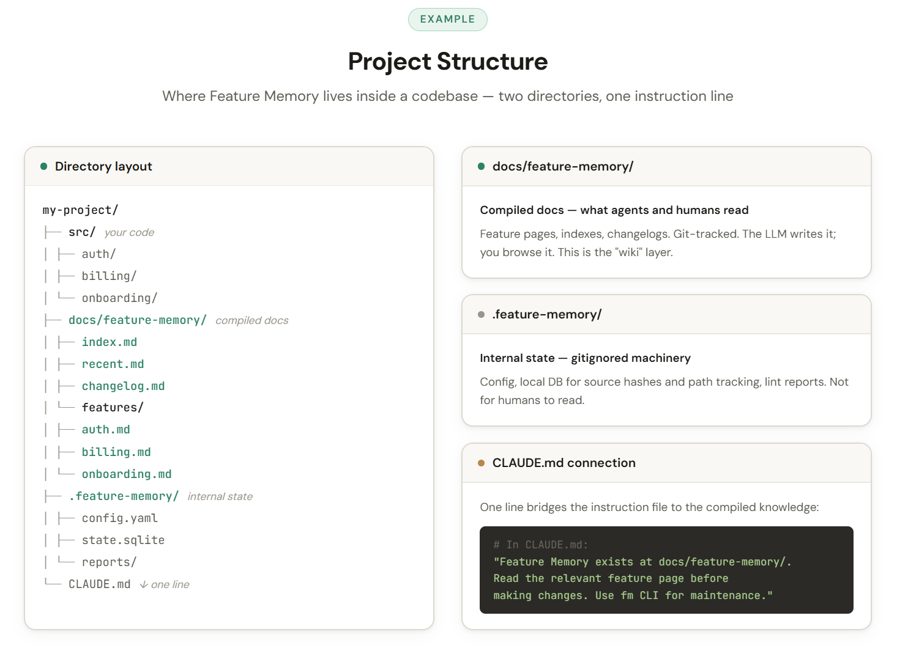

# Feature Memory

A documentation compiler for software repos. Maintains feature-level memory so agents don't rediscover the project from scratch every session.

## The problem

Every project has two codebases. The real one (files, tests, routes, configs). And the remembered one (what it does, why, which files matter, what's dead). The second one is more useful and decays fastest. Make it explicit.


## Structure

```
docs/feature-memory/
  index.md              # feature table: title, status, one-liner
  recent.md             # last 5 days of activity
  changelog.md          # append-only global log
  features/
    auth.md             # one page per feature
    billing.md
    onboarding.md

.feature-memory/
  config.yaml           # globs, route patterns, policies
  state.sqlite          # indexed cache of the markdown
  events.jsonl          # hook event log
```



Each feature page has:

```yaml
---
feature_id: auth
status: active
confidence: medium
review_status: needs_review
source_paths: [apps/web/src/auth/, apps/api/src/routes/auth.ts]
related_features: {children: [password-reset, oauth], siblings: [permissions]}
---
```

Plus: one-sentence summary, product summary, engineering summary, source map table, changelog.

## CLI

```bash
fm init                              # scaffold
fm detect --diff HEAD~1..HEAD        # classify changed files
fm map --paths src/auth/login.py     # map paths → features
fm ingest --diff HEAD~1..HEAD        # update docs from changes
fm lint                              # 15 deterministic checks
fm review                            # lint + LLM verification
fm context --for-agent               # compact context injection
```

Deterministic work in the CLI. Synthesis in the agent. Agent cites sources.

## Hooks

```
PostToolUse  →  log touched path to events.jsonl        (<2s, never blocks)
SessionStart →  inject fm context --for-agent           (<3s)
Stop         →  fm lint --changed-only, report findings (<10s)
pre-commit   →  fm lint --fail-on blocking              (<5s)
post-commit  →  fm ingest --draft-only --no-llm         (<15s)
```

Cheap hooks run on every edit. Expensive hooks (LLM summaries, review) run on PR or nightly.

## Write policy

```
automatic:       timestamps, changelog append, source maps, draft pages, backlinks
review-required: renames, merges, hierarchy changes, deprecations, positioning rewrites
never:           delete sources, erase history, resolve contradictions silently
```

## Mapping algorithm

For each changed path, try in order:
1. Exact match in source_path table → high confidence
2. Config glob match → high
3. Route pattern (`routes/{feature}.ts`) → high
4. Directory name matches feature slug → medium
5. Symbol/text hint → low
6. Unmapped policy (ignore | report | create_draft)

## Confidence lifecycle

```
new page / draft         → low
LLM-generated update     → medium
human-verified / review passes → high

hash mismatch or new ingest → review_status: needs_review
dead source path         → confidence: low
90-day silence           → review_status: stale
successful fm review     → review_status: reviewed (bump confidence)
```

Who sets it: mapping algorithm (per-path), `fm ingest` (per-feature), human (override). How it decays: staleness signals downgrade it. How it recovers: successful review or human verification.

## Verify before trust

The feature page is a cache, not a source of truth. Before acting on claims:
- If `review_status: needs_review` or `stale`, verify source paths exist and claims hold
- `fm context --for-agent` flags stale features so the agent knows which pages to distrust

## Staleness detection

Three signals, all deterministic:
- Source hash changed since last doc update
- `last_code_touch` older than 90 days
- Source map references deleted files

## Skills

One SKILL.md that tells the agent: read the feature page before editing, update docs after changes, run `fm lint`, never reorganize without a proposal.

## Reviewer

Second agent role. Cannot edit canonical docs. Checks: do source paths exist? Are claims grounded in code? Did removed behavior stay described as current? Runs on PR, not every edit.

Conflict resolution: reviewer findings are advisory unless `blocking` severity. Blocking findings gate the commit/PR. Human is the tiebreaker — can fix the doc (side with reviewer), mark `wontfix` (side with maintainer), or escalate. Reviewer never overwrites; maintainer never silently ignores a blocking finding.

## Why markdown

Agents want something they can read, patch, cite, and recover from. A markdown file with frontmatter, source links, and a changelog beats an opaque graph query for LLM consumption. The graph can be compiled from the docs when needed.

## Start here

```bash
pip install feature-memory
fm init
# write 3-5 feature pages for your most-touched features
# add the skill, add hooks, let it compound
```
