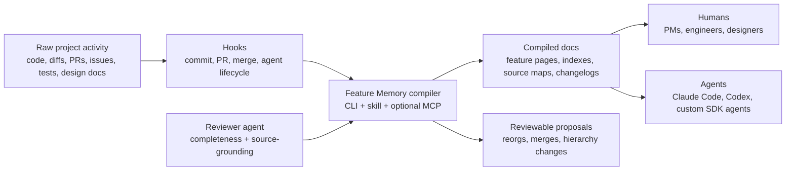

# Feature Memory: an LLM Wiki for living codebases

A sketch for a repo-native documentation compiler.

## The core idea

Every software project has two codebases.

The first is the actual codebase — files, tests, migrations, routes, components, configs, PRs, commits, production scars.

The second is the **remembered codebase** — the thing humans and agents carry around in their heads. What the product does, why a feature exists, which files matter, which weird constraint still applies, which old behavior is dead. This second codebase is usually more useful when you're trying to make a change. It's also the one that **decays fastest**.

The proposal: make that second codebase explicit. Call it **Feature Memory**.

```
raw code activity → hooks → FM compiler → compiled feature docs → agents + humans
```

It borrows the core intuition from the LLM Wiki pattern. Don't make the model rediscover the project from raw files on every question. Let it **incrementally compile** important knowledge into a persistent, interlinked artifact.

But instead of compiling articles or personal notes into a general wiki, we compile **software activity into feature-level memory**.

Every meaningful feature gets a maintained page with:

- a **one-sentence index entry**
- a short **product/business summary** (for PMs, designers, new engineers)
- a short **engineering summary** (for developers — names files, routes, components)
- a **source map** linking code files to features
- **relationship notes** (parent features, children, siblings, shared components)
- an **append-only changelog**
- **metadata**: timestamps, confidence scores, review status

The human owns taste, judgment, and intent. The agent owns bookkeeping.


## Why not just use a graph?

Tempting. Codebases are graphs. Products are graphs. Features depend on each other. Files import each other.

But agents don't necessarily want the mathematically cleanest substrate. They want the substrate they can **read, patch, cite, and recover from**.

A markdown file with a good summary, source links, and a changelog is often more useful to an LLM than a precise but opaque graph query. The page isn't a replacement for structure — it's the **agent-readable compiled view** of structure.

The trick is putting just enough structure around the markdown:

```
YAML frontmatter  →  metadata you can query
stable slugs      →  identity that survives renames  
wikilinks         →  relationships you can traverse
source maps       →  provenance you can verify
changelogs        →  time you can audit
CLI               →  operations you can automate
hooks             →  refresh that happens without asking
review gates      →  safety for risky edits
```

The graph exists implicitly. It can be compiled from the docs whenever you need it. But **the docs stay the primary interface** — the thing humans and agents actually read.

## The shape of it

```
Sources → Compiler → Compiled Docs → Consumers
                ↑                        ↓
           Reviewer ← ← ← ← ← ← ← Proposals
```

Four layers:

```
1. Sources         code, tests, diffs, commits, PRs, design docs
2. Compiled docs   feature pages, indexes, source maps, changelogs
3. Metadata        frontmatter, timestamps, confidence, status, hashes
4. Tools           CLI, hooks, skills, plugins, MCP server, reviewer agent
```

**Raw sources are always the source of truth.** The compiled docs are the maintained memory layer. The schema tells the agent how to behave as a **disciplined maintainer** instead of a generic summarizer.


Here's how data flows:



## What a feature page looks like

```md
---
type: feature
feature_id: auth
status: active
created: 2026-05-17
updated: 2026-05-17
last_code_touch: 2026-05-17
confidence: medium
review_status: needs_review
source_paths:
  - apps/web/src/auth/
  - apps/api/src/routes/auth.ts
related_features:
  parents: []
  children: [password-reset, oauth-login]
  siblings: [user-profile, permissions]
---

# Auth

## One-sentence summary

Handles user sign-in, sign-out, session management, and account access flows.

## Product / business summary

Auth is the gate into the product. Users identify themselves, recover access,
and establish a trusted session. Currently supports email/password login and
session persistence. OAuth and password reset are tracked as child flows.

## Engineering summary

The web auth flow lives under `apps/web/src/auth/`. `LoginForm.tsx` collects
credentials and calls `apps/api/src/routes/auth.ts`. Session state uses the
shared session helper, read by protected route guards. Tests cover successful
login and invalid credentials; expiry behavior is partially covered.

## Source map

| Path | Role |
|---|---|
| `apps/web/src/auth/LoginForm.tsx` | Login UI |
| `apps/api/src/routes/auth.ts` | Auth API route |
| `packages/session/index.ts` | Shared session helper |

## Recent changes

- 2026-05-17 — Login validation changed to reject blank emails before API call.
```

Not encyclopedic. Just the page an agent reads **before** touching auth and a human skims before joining a conversation.


## Hooks are the maintenance engine

Manual docs rot. The moment to update docs is always the moment everyone wants to move on. So the system runs **near the moment of change**:

```
file edit → log path (free, <2s)
commit    → draft ingest, update source maps (<15s)
PR        → impact report, lint findings (<30s)
merge     → promote docs, update index, run full lint (<30s)
nightly   → stale checks, reorg proposals (unbounded)
```

This maps well to modern agent environments:

- **Claude Code** has lifecycle hooks with five handler types — commands, HTTP handlers, MCP tools, prompts, and subagents — around events like `PostToolUse`, `SessionStart`, `Stop`
- **Codex** has lifecycle hooks for the same event points, though currently limited to command handlers (prompt and agent handlers are parsed but not yet executed)
- **Skills** package the workflow instructions
- **Plugins** package the whole thing for install

**The cost model matters.** Not every hook should call an LLM:

```
cheap (deterministic, milliseconds):  log paths, update timestamps, append events
expensive (LLM, seconds):             generate summaries, run reviews
```

Cheap hooks fire on every edit. Expensive hooks batch at meaningful boundaries — commit, PR, merge. Per-commit cost stays near zero. Per-PR cost: a few cents.

**Documentation maintenance becomes a side effect of software maintenance**, not a separate chore.


## The CLI

```
deterministic work → CLI
synthesis work     → agent (citing sources, writing patches)
```

```bash
fm init                              # scaffold the structure
fm detect --diff HEAD~1..HEAD        # what changed? classify files
fm map --paths src/auth/login.py     # which features are affected?
fm ingest --diff HEAD~1..HEAD        # update docs from changes
fm lint                              # 15 deterministic quality checks
fm review                            # lint + LLM source verification
fm context --for-agent               # compact context for injection
fm query "how does signup work?"     # search feature docs
fm propose-reorg                     # suggest structural changes
fm apply-proposal report.yaml        # execute reviewed proposals
```

**Rule of thumb:** if it can be deterministic, it goes in the CLI. If it needs synthesis, the model does it — but it **cites source paths** and writes **reviewable patches**.

## Safe writes vs. scary writes

**This is the most important design detail.**

The agent should update docs automatically. It should **not** reshape the knowledge base whenever it feels clever.

```
SAFE (automatic):
  timestamps, changelog entries, source maps, backlinks, draft pages

REVIEW REQUIRED:
  renames, moves, merges, hierarchy changes, deprecations, positioning rewrites

NEVER AUTOMATIC:
  delete sources, erase history, resolve contradictions silently
```

The agent may **propose** reorganization. It should not **execute** it. The map that future agents depend on deserves a review gate.

## The reviewer agent

```
maintainer writes → reviewer checks → human approves → docs commit
```

A second agent role that **cannot edit canonical docs**. It just verifies:

- Are the source paths real?
- Does the summary claim behavior not present in code?
- Did removed behavior stay described as current?
- Are changed files mapped to a feature?
- Did the update touch the **smallest useful surface**?
- Are uncertain relationships marked `needs_review`?

This gives you something closer to a **compiler pipeline** than a note-taking bot. The reviewer adds token cost — so run it on PR or nightly, not every edit.

### Conflict resolution

What happens when the reviewer disagrees with the maintainer?

```
reviewer finding → severity assessment → gate or advise → human resolves
```

- **Advisory findings** (`info`, `low`, `medium`, `high`): recorded as open findings, surfaced in PR comments and reports. The maintainer can proceed — the finding is a flag, not a wall.
- **Blocking findings** (`blocking`): gate the commit via pre-commit hook or block the PR. The maintainer cannot land docs with unresolved blocking findings.
- **Resolution options**: human fixes the doc (sides with reviewer), marks finding as `wontfix` (sides with maintainer with justification), or escalates.

The reviewer never overwrites. The maintainer never silently ignores a `blocking` finding. The human is always the tiebreaker. This isn't a contradiction with the reviewer being read-only — it's enforcement without write access, like a CI check that can fail your build without pushing code itself.

## Confidence lifecycle

The `confidence` field tracks how much you should trust a feature page. It has a clear lifecycle:

### Who sets it

- **New feature page** (manual or `fm init`): starts at `low`
- **Mapping algorithm** (per source_path): `high` for exact/glob matches, `medium` for directory matches, `low` for symbol hints
- **LLM ingest** (`fm ingest --llm`): sets `medium` — the LLM produced it, but a human hasn't verified
- **Human review**: can set `high` — a human confirmed the claims are accurate

### How it decays

Confidence doesn't decay on a timer. It decays on **evidence of drift**:

- Source hash mismatch (file changed since last doc update) → `review_status` drops to `needs_review`
- Dead source path (file deleted) → confidence drops to `low`
- 90+ days with no code touch on an active feature → `review_status` drops to `stale`

### How it recovers

- `fm review` passes with no findings → `review_status` becomes `reviewed`, confidence can be bumped to `high`
- Human manually edits and verifies → confidence set to `high`
- `fm ingest` runs after fresh changes → confidence resets to `medium`, `review_status` to `needs_review`

### The `review_status` field

Tracks the review state separately from confidence:

```
needs_review → reviewed (after successful review)
needs_review → stale (after 90-day silence or staleness signal)
reviewed → needs_review (after new ingest or source hash change)
stale → needs_review (after ingest or manual update)
```

Confidence is "how much can I trust this?" — review_status is "has someone checked recently?"

## Verify before trust

**The feature page is a cache, not a source of truth.**

Before acting on a claim from a feature page, the agent must verify it — especially when:

- `review_status` is `needs_review` or `stale`
- `confidence` is `low`
- The feature's source paths have changed since `last_code_touch`

Verification means: check that the source paths still exist, read the relevant source files, confirm the claimed behavior is still present. If the doc says "LoginForm validates emails client-side" but the code shows server-side validation, the doc is wrong — fix it, don't trust it.

The `fm context --for-agent` output flags stale features so the agent knows which pages to distrust before it reads them.

## Staleness detection

Three deterministic signals (no LLM needed):

1. **Source hash mismatch** — file on disk differs from the hash recorded when docs were last updated
2. **Timestamp delta** — `last_code_touch` older than 90 days on an active feature
3. **Dead paths** — source map references files that no longer exist

```
hash changed?     → probably stale
90+ days quiet?   → suspiciously stale  
path deleted?     → definitely stale
```

These surface candidates for review. They don't rewrite anything.

## Context window strategy

50 features = a lot of docs. The agent shouldn't load everything.

```
fm context --for-agent → compact summary (few hundred tokens)
                        → feature index (titles + one-liners)
                        → recent activity
                        → features likely affected by current diff

agent reads full page → only for features it's about to touch
```

Same as how a human works: **scan the table of contents, then open the relevant chapter**.

## Relationship to CLAUDE.md and AGENTS.md

Feature Memory **supplements** project instruction files, it doesn't replace them.

```
CLAUDE.md / AGENTS.md  →  project-wide rules (stable, rarely changes)
Feature Memory         →  compiled feature knowledge (changes with code)
```

The connection is a short snippet in CLAUDE.md: "Feature Memory exists at `docs/feature-memory/`. Read the relevant feature page before making changes. Use `fm` CLI for maintenance."

## Why this might work

The tedious part of documentation isn't writing a paragraph once. It's **keeping the paragraph true** after the 19th refactor, the third PM rename, the half-finished migration, and the bug fix that changed an edge case nobody remembers.

LLMs are pretty good at **localized maintenance** when given the diff, current docs, relevant files, and narrow instructions.

```
hooks        →  locality (run at the right time)
skills       →  workflow (know what to do)
markdown     →  stability (artifact that survives)
git          →  history (never lose the past)
CLI          →  repeatability (same result every time)
```

Each piece is simple. Together, they produce **a project memory that compounds**.

A new engineer asks "how does billing work?" → gets the compiled page, not a blind import search. An agent reads feature memory before editing → avoids rediscovering constraints. A PM skims product summaries → no code reading required. A reviewer sees which docs changed with the PR.

## Why this might fail

It fails if the agent gets **too creative**.

It fails if every edit triggers a **giant rewrite**.

It fails if summaries are **not source-grounded**.

It fails if the docs become a **polished hallucination layer** over the code.

It also fails if the system itself becomes unmaintained. Real risk — you're adding a tool that also needs upkeep. The mitigation: the system is deliberately small, and its failure mode is **graceful degradation**. Stale docs are still more useful than no docs. The system degrades into a read-only archive, not a corrupted mess.

The system needs **humility built in**: confidence fields, `needs_review`, source paths, append-only logs, lint passes, and review-gated structural changes.

### How is this different from Notion / Confluence / README.md?

The difference isn't the format. It's the **maintenance loop**.

```
Notion       →  written once by a human, decays silently
README.md    →  updated when someone remembers
Feature Memory → updated by hooks at moment of change,
                 validated by lint that catches drift,
                 reviewed by an agent that checks source grounding
```

The format (markdown in git) is deliberately boring. The value is in the **automation that keeps it current**.

## Minimal starting version

You don't need embeddings, MCP, marketplaces, or a plugin on day one.

```
docs/feature-memory/
  index.md
  recent.md
  changelog.md
  features/
    auth.md
    billing.md
    onboarding.md

.feature-memory/
  config.yaml
  state.sqlite
  reports/
```

Then:

```bash
fm init                           # scaffold
fm ingest --diff HEAD~1..HEAD     # seed from recent history
fm lint                           # check health
```

Then add a skill. Then add hooks. Then package as a plugin if it keeps working.

```
day 1:    write 3-5 feature pages manually
day 2:    add CLI + skill
week 2:   add hooks
month 2:  package as plugin, publish
```

### Bootstrapping an existing project

For greenfield: `fm init` + a few pages. Done.

For an existing project with years of history: **start with 5-10 features you touch most.** Write those pages by hand or have the agent draft them. Don't document everything at once. Run `fm ingest --diff HEAD~50..HEAD --no-llm` to seed recent activity, then let hooks maintain it going forward.

**Initial cost:** a few hours. **Ongoing cost:** near zero — hooks handle it. **Compounding value:** starts the first day someone asks "how does X work?" and gets a useful answer without a 20-minute archaeology session.

## References

- Karpathy's LLM Wiki gist pattern: raw sources → compiled wiki → schema → ingest/query/lint → index + log
- Claude Code docs: hooks, hook reference, plugins, skills, MCP, project instructions
- OpenAI Codex docs: hooks, skills, plugins, MCP, AGENTS.md, documentation-update use case
- OpenAI Agents SDK docs: tools, handoffs, lifecycle hooks, sessions, tracing, guardrails, MCP

Official docs:

- https://code.claude.com/docs/en/hooks
- https://code.claude.com/docs/en/hooks-guide
- https://code.claude.com/docs/en/plugins
- https://code.claude.com/docs/en/skills
- https://developers.openai.com/codex/hooks
- https://developers.openai.com/codex/skills
- https://developers.openai.com/codex/plugins
- https://developers.openai.com/codex/use-cases/update-documentation
- https://openai.github.io/openai-agents-python/
